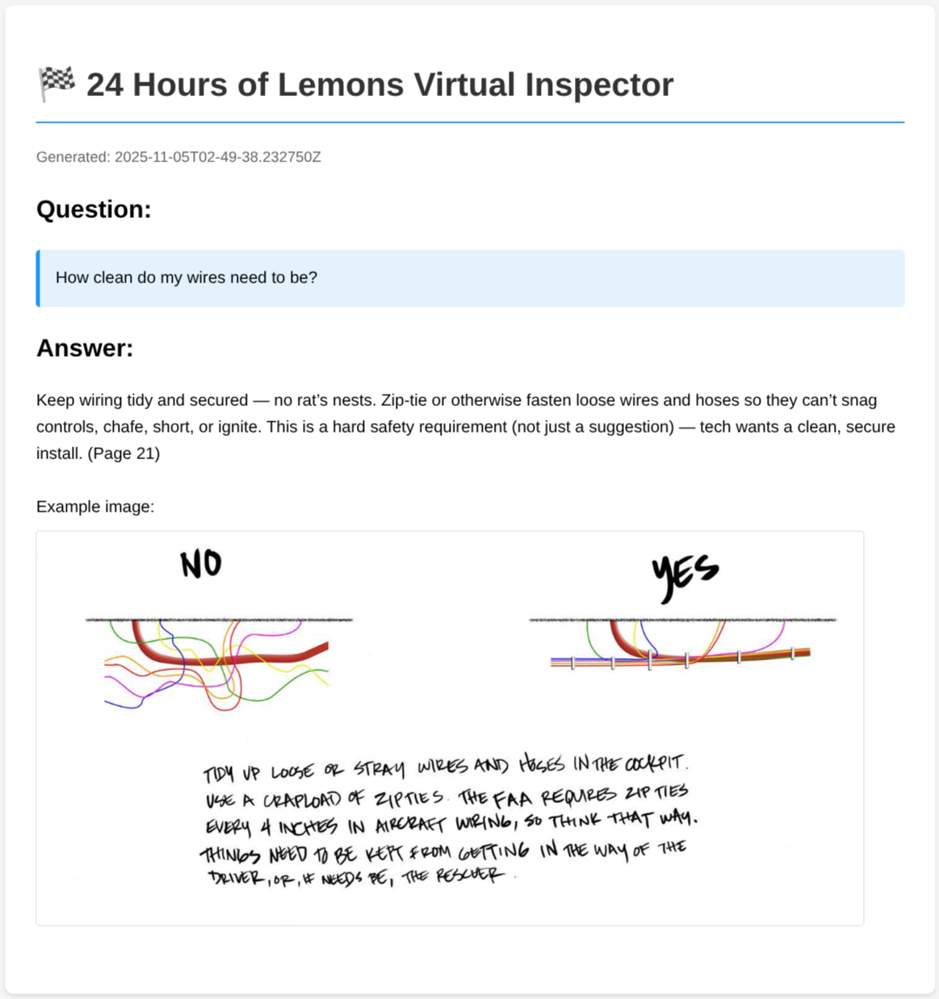

# HoursOfLemons



The intention of this project is to create a **vertical slice** of a Virtual Assistant that answers question from a PDF, reinforcing with images and referenced page numbers.

The subject of this project is 24 Hours of Lemons, described as "An endurance car racing series on dedicated road courses for $500 cars".

## Setup and running this prototype
**REQUIREMENTS**
- ***A VALID `OPENAI_API_KEY` IS REQUIRED*** to run this demo successfully.
- I'm running this project with **Elixir 1.18.4 and Erlang/OTP 28**, you will need something similar to this.

The bones of this project, along with the source material, and example responses are included to make the demo easily investigatable and runnable.

Steps: 
1. clone project
2. cd into project
3. run `mix deps.get`
4. run `iex -S mix`
5. query the virtual assistant with `HoursOfLemons.ask_virtual_assistant("What are the relevant helmet requirements?")`
6. read response in terminal OR open *.HTML file in /data/responses/

Here's an example of a request and response you will receive:
```
iex(2)> HoursOfLemons.ask_virtual_assistant("Any helmet related requirements? ")
Yes — helmets need to provide at least 2 inches of clearance to the roll cage and be proper racing helmets (hard requirement for safety). Specifically:

- You must have at least 2" of clearance between the top of the tallest driver’s helmet and the area enclosed by the cage (hard requirement) (Page 8).
  - Illustration: shows helmet clearance measurement — view: file:///home/kgf/src/projects/hours_of_lemons/data/extracted/images/page_8_img_1.jpeg

- While the short guide emphasizes helmet clearance, you must also use an appropriate helmet that meets accepted motorsport standards (SNELL/SA, etc.) per the full Lemons rulebook and tech checklist — this guide references helmet clearance as a mandatory safety standard (Page 8) and assumes compliant helmets per the rulebook (Pages 2–3 overview).

If you want, tell me the helmet make/model and I’ll check common approvals (SNELL SA2015/2020, DOT is NOT sufficient for wheel-to-wheel racing in most events) and whether it’s likely acceptable.

HTML response saved to: /home/kgf/src/projects/hours_of_lemons/data/responses/response_2025-11-06T02-22-53.784527Z.html
:ok
```

## What problem I decided to tackle and why
24 Hours of Lemons has many resources on their site, including checkboxes, drop-down lists, PDFs, and more. For this prototype I'll be tackling a PDF with technical pictures and descriptive instructions on various pages. This prototype can be extended to interact with any technical PDF 24 Hours of Lemons has. PDFs can be an arbitrary length and contain dozens of pictures, leading to potential intimidation and slowdown for anyone looking to glean useful and accurate information. This Virtual Assistant seeks to ease these problems and help users search through PDFs more effectively by supplying answers, images, and page numbers relevant to the user inquiry. An added benefit of using the Virtual Assistant is it's ability to tie together queries across topics; for example, if a user asks a question about a roll cage, the Virtual Assistant is able to identify multiple sections of the document containing useful information. Notably, this extends beyond the historically effective strategy of skimming headers for useful reference points.

## How did I approach this problem?
I approached this prototype with a data first approach. In order to deliver an accurate and reference-friendly Virtual Assistant, I needed to first extract useful information from the PDF. The PDF in question is: https://24hoursoflemons.com/wp-content/themes/lemons/assets/images/how-to-not-fail-lemons-tech-inspection.pdf . 

I used a popular python library called `pymupdf` to extract the text and images from the PDF. The structure of the extracted data can be seen in `data/extracted/`; it's comprised of a file of images labeled `page_{page_number}_image_{number}` with an extension of `.png` or `.jpg`. The text is all in a single file called `extracted_metadata.json`. Each `page` has a `page_number`, `text`, as well as `images`, and an `image_count`. Notably, each image in `images` references an extracted image; this is powerful because the Virtual Assistant can now compartmentalize each page to what text and images it contains. We'll see this feature's importance when prompting a response.

After solving the data extraction, I started to build the virtual assistant. Here are a number of design decisions and implementation details: 
- **GenServer as a foundation**: I settled on a GenServer because I wanted the capability to change different components of the Virtual Assistant at runtime if need be. For example, what happens if a new version of the dataset exists? I would want the Virtual Assistant to be able to reference the new dataset without needing a reset, promoting zero-downtime practices. To facilitate this, I store important keys like the `:dataset_path` path as an atom I can update in the future if need be. GenServers also offer an easy extension to store conversation state or anything else if need be, over the course of the Virtual Assistant's lifetime.
- **Query-able, not conversational**: because this is a prototype, I opted for a single query approach. The user is not having a conversation with a Virtual Assistant, instead they will be issuing specific queries for the Virtual Assistant. 
- **Simple interface**: the only actions the user can take are `query` or `start_link`. For my use case, I want to start up my Virtual Assistant and start asking questions, these two functions facilitate these goals nicely.
- **Only support querying OpenAI**: in general, I'm a big believer in being "llm agnostic" - aka not needing to rely on any specific provider. However, for this project I opted to write a *small* amount of boiler plate to query off to OpenAI to generate a simple response. I'm not using tool-use or reasoning or previous_response_ids or anything else like that.
- **No dataset searching required**: in an effort to prove out a prototype, I opted to put the extracted text objects into the system prompt. This enabled rapid prototyping and removed necessary boiler plate around storing records and embedding them.
- **Render results as HTML Page**: I'm rendering the results of the query to an HTML page that can be easily opened up in a browser (double click the file in a file directory application to do so). I found this to be the easiest and clearest way to display the pictures alongside the text. If user's would prefer a text only approach, I also print out the results to the terminal. 

## What’s working and what’s not
### Here's what's working: 
- The data extraction separated the images from the text
  - criteria: I have a directory of images and a metadata document of text objects
- Images belong to a page and are cited as so
  - criteria: I have images apart of the text objects in the `extracted_metadata.json` file
- The Virtual Assistant is able to answer questions intelligently
  - criteria: The responses supplied by the agent when running `HoursOfLemons.ask_virtual_assistant/1` and saved to `/data/responses`
- Virtual Assistant references page numbers in response 
  - criteria: page number annotations like `(Page 8)` appearing in response text
- Virtual Assistant references relevant images in response 
  - criteria: images included in response like "- Illustration: shows helmet clearance measurement — view: file:///home/kgf/src/projects/hours_of_lemons/data/extracted/images/page_8_img_1.jpeg"

### Here's what's not working: 
- Virtual Assistant can't read the text inside the images, leaving out valuable information the user could ask about
  - criteria: I've asked image-specific information and the Virtual Assistant has been unable to answer. I also never allow the Virtual Assistant to read through or interact with the images directly; it only ever references them via id
  - solution: add image processing in ingestion step
- The customer can not have a conversation with the Virtual Assistant
  - criteria: Virtual Assistant does not remember the past user interaction when interacting with the same `pid`
  - solution: add conversation messages to GenServer, append message once processed
- Virtual Assistant oversteps it's capabilities and induces false agency
  - criteria: With query "Any helmet related requirements?", Virtual Assistant says "If you want, tell me the helmet make/model and I’ll check common approvals (SNELL SA2015/2020, DOT is NOT sufficient for wheel-to-wheel racing in most events) and whether it’s likely acceptable.". NOTE: there is no functionality to make this check to begin with
  - solution: evaluate hallucination evalutation model before sending message 
- Virtual Assistant not including every image 
  - criteria: Ask "Can I have cracks in my windshield?" and only have 1 image instead of the expected 2
  - solution: annotate the images to teach the AI what is in each image

## Conclusion
This prototype serves as an example of a Virtual Assistant which generates answers related to an ingested PDF, by including text, images, and page numbers in its responses. This build is the first version of a sophisticated Virtual Assistant that can answer a multitude of complex questions related to 24 Hours of Lemons rules and regulations. 
